# UML-Dokumentation — PHANTOM OSINT Investigation Platform

**Version:** 1.0.0  
**Datum:** Mai 2026  
**Notation:** Mermaid (GitHub-nativ renderbar)

---

## Inhaltsverzeichnis

1. [Use-Case-Diagramm](#1-use-case-diagramm)
2. [Klassendiagramm — Domain Model](#2-klassendiagramm--domain-model)
3. [Klassendiagramm — Transform-System](#3-klassendiagramm--transform-system)
4. [Entity-Relationship-Diagramm (ERD)](#4-entity-relationship-diagramm)
5. [Komponentendiagramm](#5-komponentendiagramm)
6. [Sequenzdiagramm — Transform ausführen](#6-sequenzdiagramm--transform-ausführen)
7. [Sequenzdiagramm — Case laden](#7-sequenzdiagramm--case-laden)
8. [Sequenzdiagramm — WebSocket-Verbindung](#8-sequenzdiagramm--websocket-verbindung)
9. [Aktivitätsdiagramm — OSINT-Untersuchung](#9-aktivitätsdiagramm--osint-untersuchung)
10. [Aktivitätsdiagramm — Transform-Execution-Flow](#10-aktivitätsdiagramm--transform-execution-flow)
11. [Zustandsdiagramm — Transform-Job](#11-zustandsdiagramm--transform-job)
12. [Zustandsdiagramm — WebSocket-Verbindung](#12-zustandsdiagramm--websocket-verbindung)

---

## 1. Use-Case-Diagramm

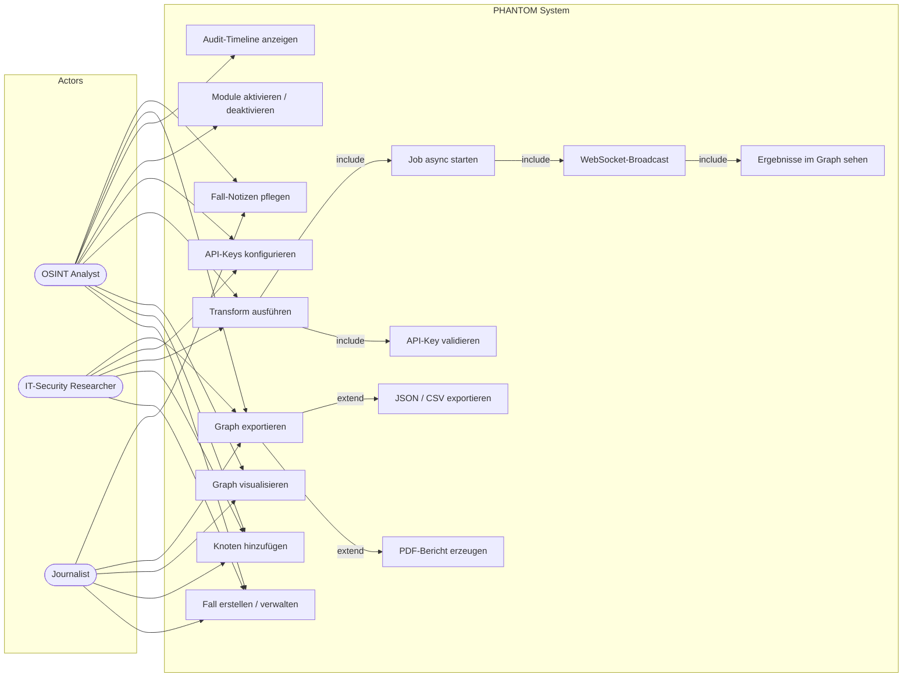

---

## 2. Klassendiagramm — Domain Model

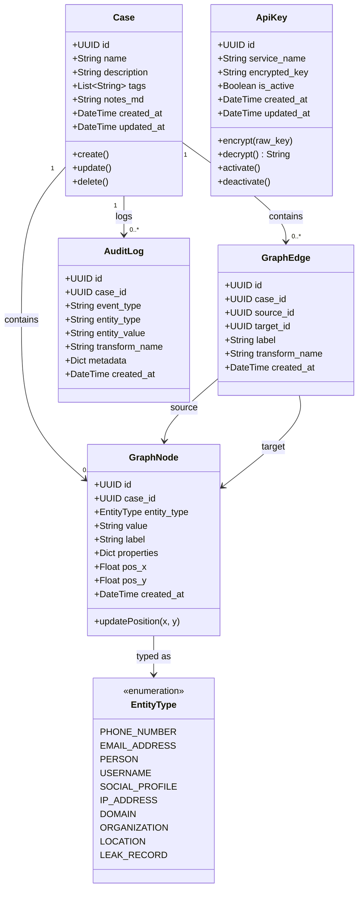

---

## 3. Klassendiagramm — Transform-System

```mermaid
classDiagram
    class BaseTransform {
        <<abstract>>
        +String name
        +String description
        +List~EntityType~ input_types
        +List~EntityType~ output_types
        +Int timeout
        +Int rate_limit
        +run(entity, api_keys)* TransformResult
        +execute(entity, api_keys) TransformResult
    }

    class Entity {
        +EntityType type
        +String value
        +Dict properties
        +String label
    }

    class TransformResult {
        +List~Entity~ entities
        +List~Dict~ edges
        +Dict metadata
        +String error
        +Int duration_ms
    }

    class TransformRegistry {
        -Dict~String, BaseTransform~ _transforms
        +register(transform)
        +get_by_name(name) BaseTransform
        +get_for_entity_type(type) List
        +all_transforms() List
    }

    class PhoneInfogaTransform {
        +name = "PhoneInfoga Scanner"
        +run(entity, api_keys) TransformResult
        -_parse_number(raw) PhoneNumber
        -_enrich_numverify(e164, key) Entity
    }

    class PlatformRegistrationTransform {
        +name = "Platform Registration Checker"
        +run(entity, api_keys) TransformResult
        -_check_whatsapp(e164) Entity
        -_check_telegram(e164, token) Entity
        -_check_signal(e164) Entity
        -_check_instagram(e164) Entity
        -_check_snapchat(e164) Entity
        -_check_amazon(e164) Entity
    }

    class CNAMLookupTransform {
        +name = "CNAM / Reverse Lookup"
        +run(entity, api_keys) TransformResult
    }

    class LeakCheckTransform {
        +name = "Leak Database Check"
        +run(entity, api_keys) TransformResult
    }

    class SocialProfileLinkerTransform {
        +name = "Social Media Profile Linker"
        +run(entity, api_keys) TransformResult
        -_whatsapp_profile(e164) Entity
        -_telegram_profile(e164, token) Entity
    }

    class IPDomainIntelTransform {
        +name = "IP/Domain Intelligence"
        +run(entity, api_keys) TransformResult
        -_geo_lookup(value) List~Entity~
        -_rdns(value, is_ip) List~Entity~
        -_dns_records(domain) List~Entity~
        -_shodan(value, is_ip, key) List~Entity~
    }

    class UsernameSearchTransform {
        +name = "Username Search"
        +run(entity, api_keys) TransformResult
    }

    class EmailOSINTTransform {
        +name = "Email OSINT"
        +run(entity, api_keys) TransformResult
    }

    class GoogleDorkingTransform {
        +name = "Google Dorking"
        +run(entity, api_keys) TransformResult
    }

    class SocialGraphExpansionTransform {
        +name = "Social Graph Expansion"
        +run(entity, api_keys) TransformResult
    }

    BaseTransform <|-- PhoneInfogaTransform
    BaseTransform <|-- PlatformRegistrationTransform
    BaseTransform <|-- CNAMLookupTransform
    BaseTransform <|-- LeakCheckTransform
    BaseTransform <|-- SocialProfileLinkerTransform
    BaseTransform <|-- IPDomainIntelTransform
    BaseTransform <|-- UsernameSearchTransform
    BaseTransform <|-- EmailOSINTTransform
    BaseTransform <|-- GoogleDorkingTransform
    BaseTransform <|-- SocialGraphExpansionTransform

    BaseTransform --> Entity : consumes
    BaseTransform --> TransformResult : produces
    TransformRegistry --> BaseTransform : manages
```

---

## 4. Entity-Relationship-Diagramm

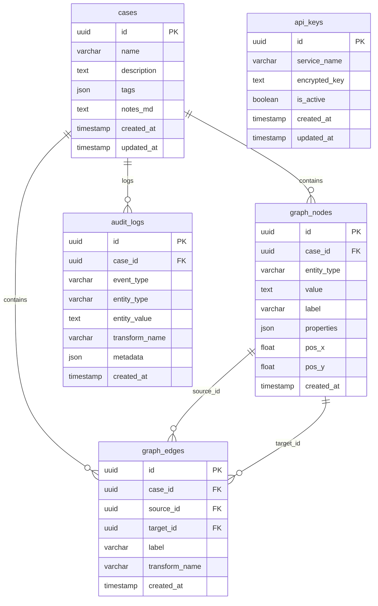

---

## 5. Komponentendiagramm

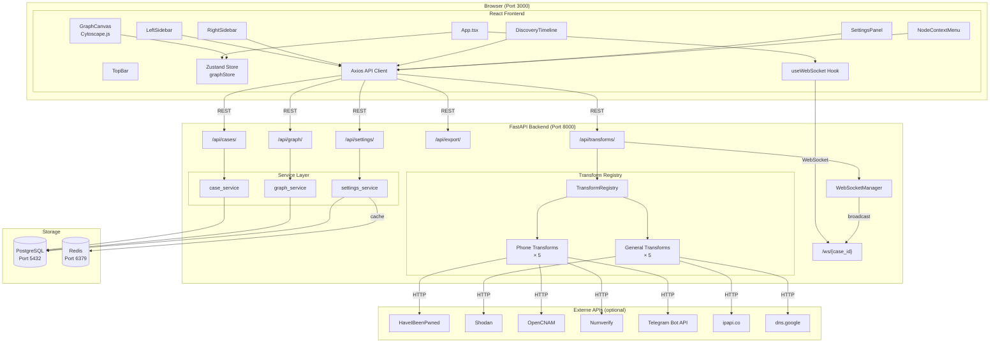

---

## 6. Sequenzdiagramm — Transform ausführen

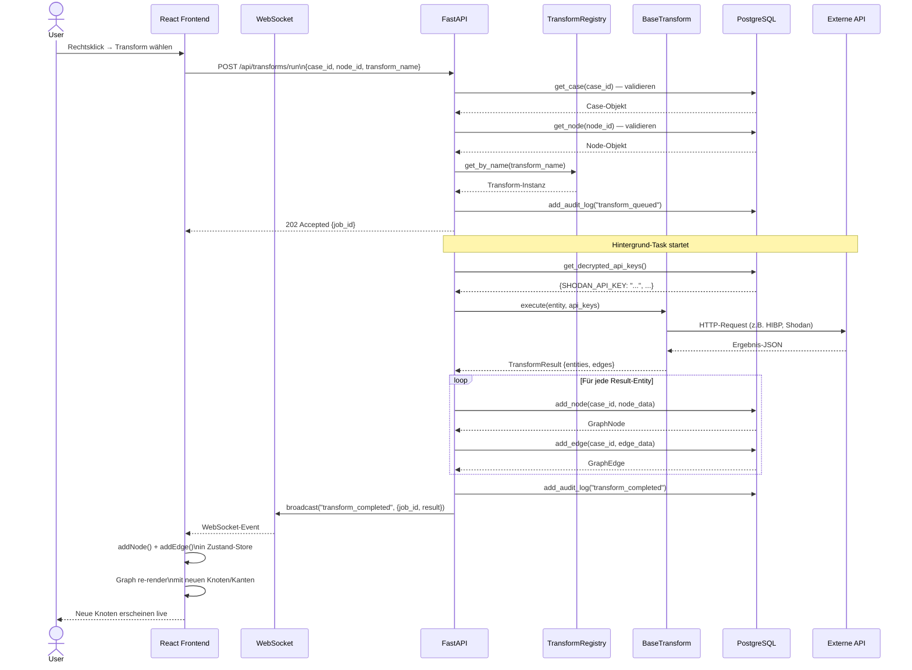

---

## 7. Sequenzdiagramm — Case laden

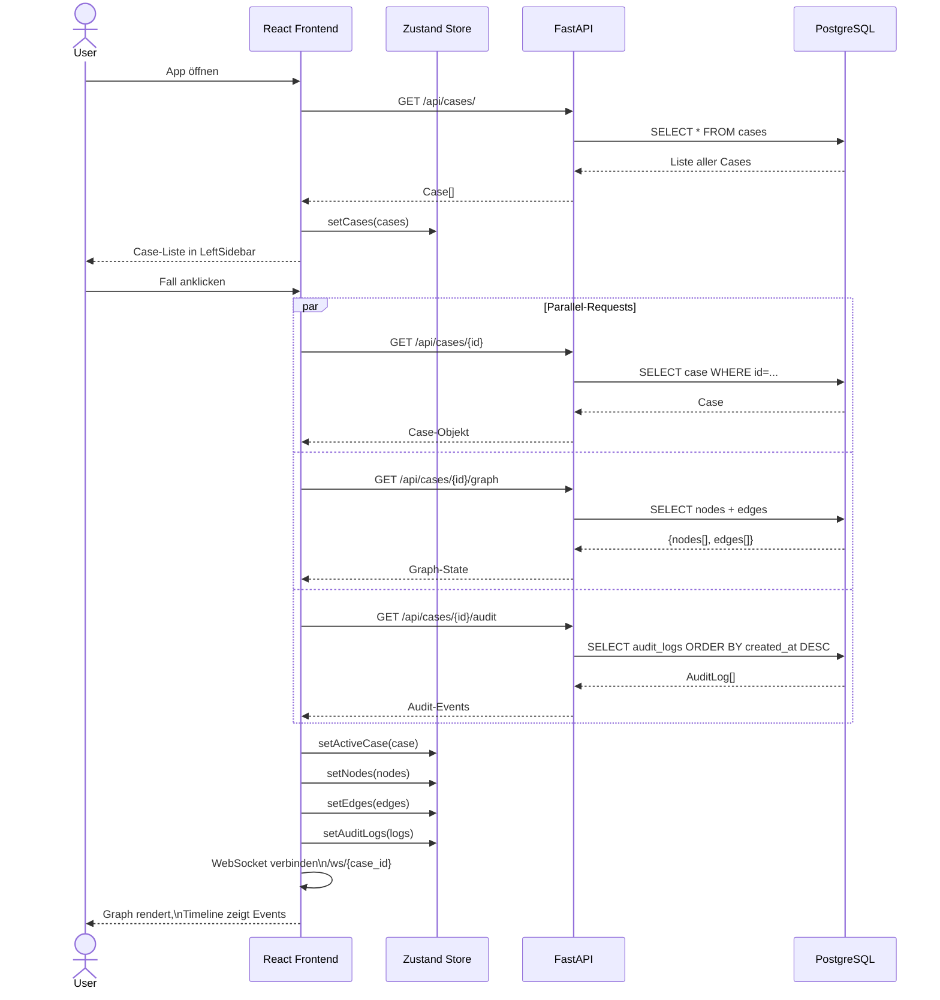

---

## 8. Sequenzdiagramm — WebSocket-Verbindung

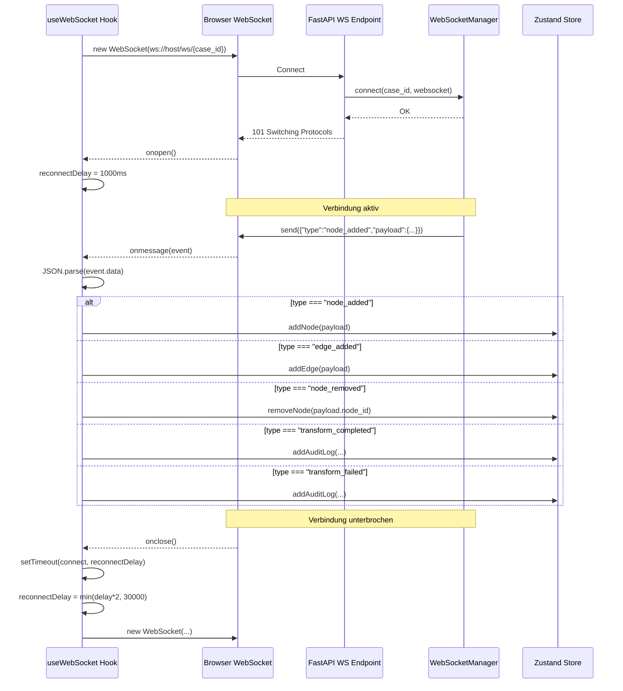

---

## 9. Aktivitätsdiagramm — OSINT-Untersuchung

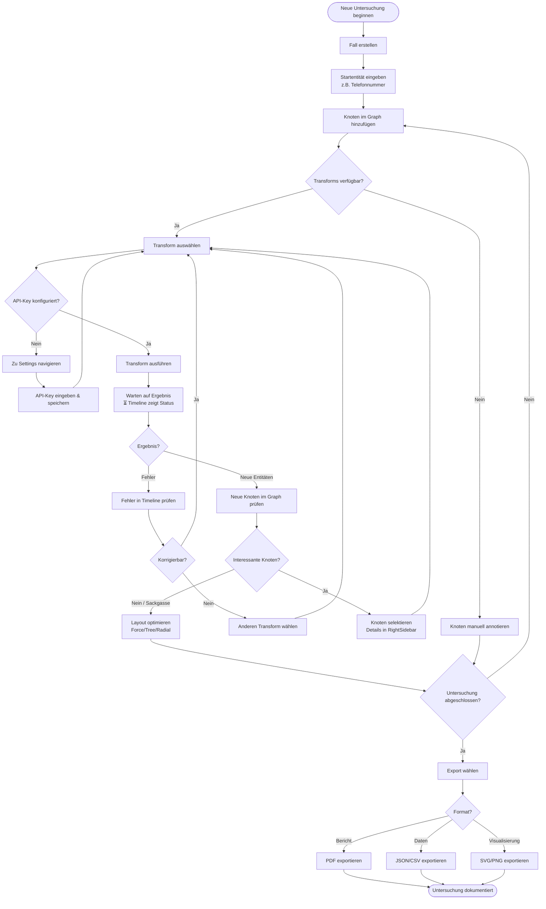

---

## 10. Aktivitätsdiagramm — Transform-Execution-Flow

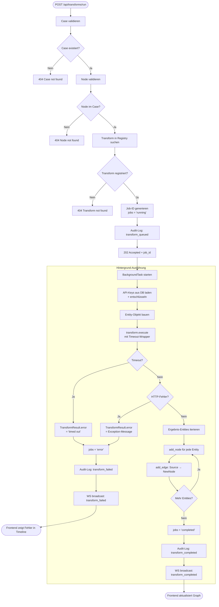

---

## 11. Zustandsdiagramm — Transform-Job

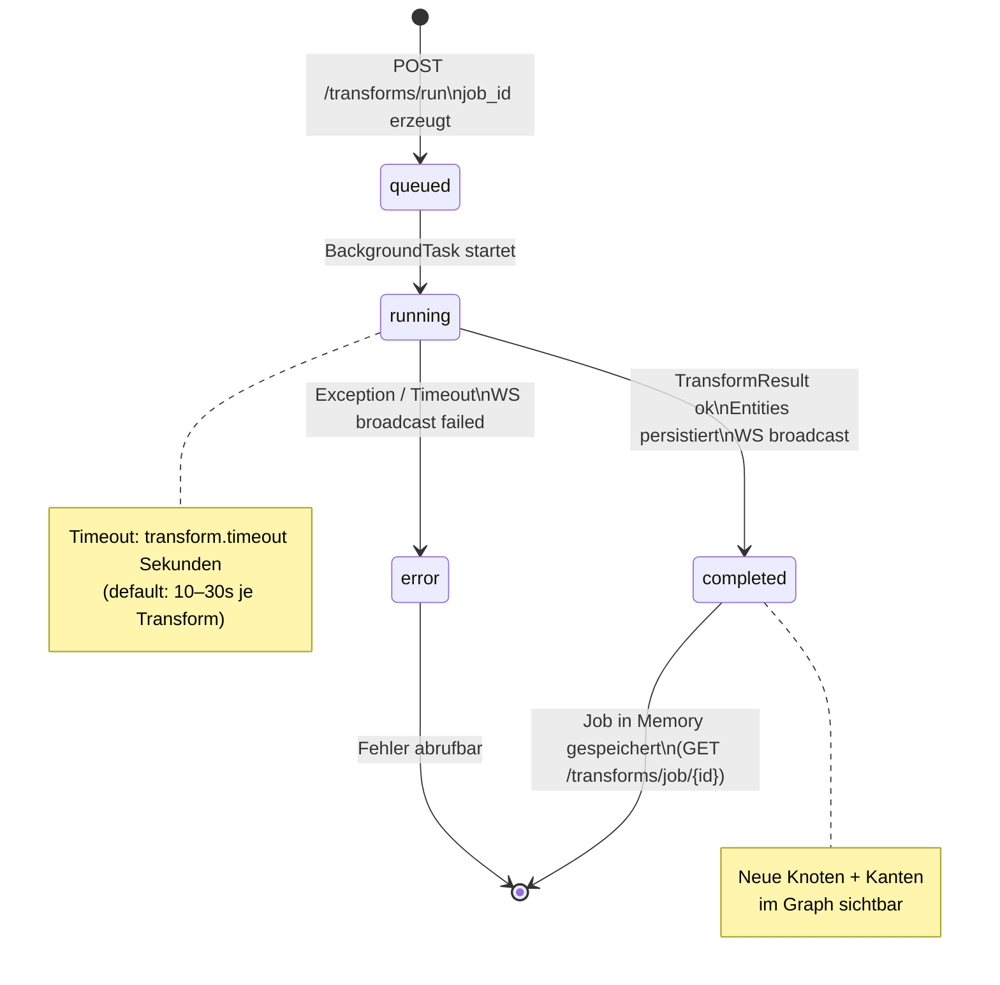

---

## 12. Zustandsdiagramm — WebSocket-Verbindung

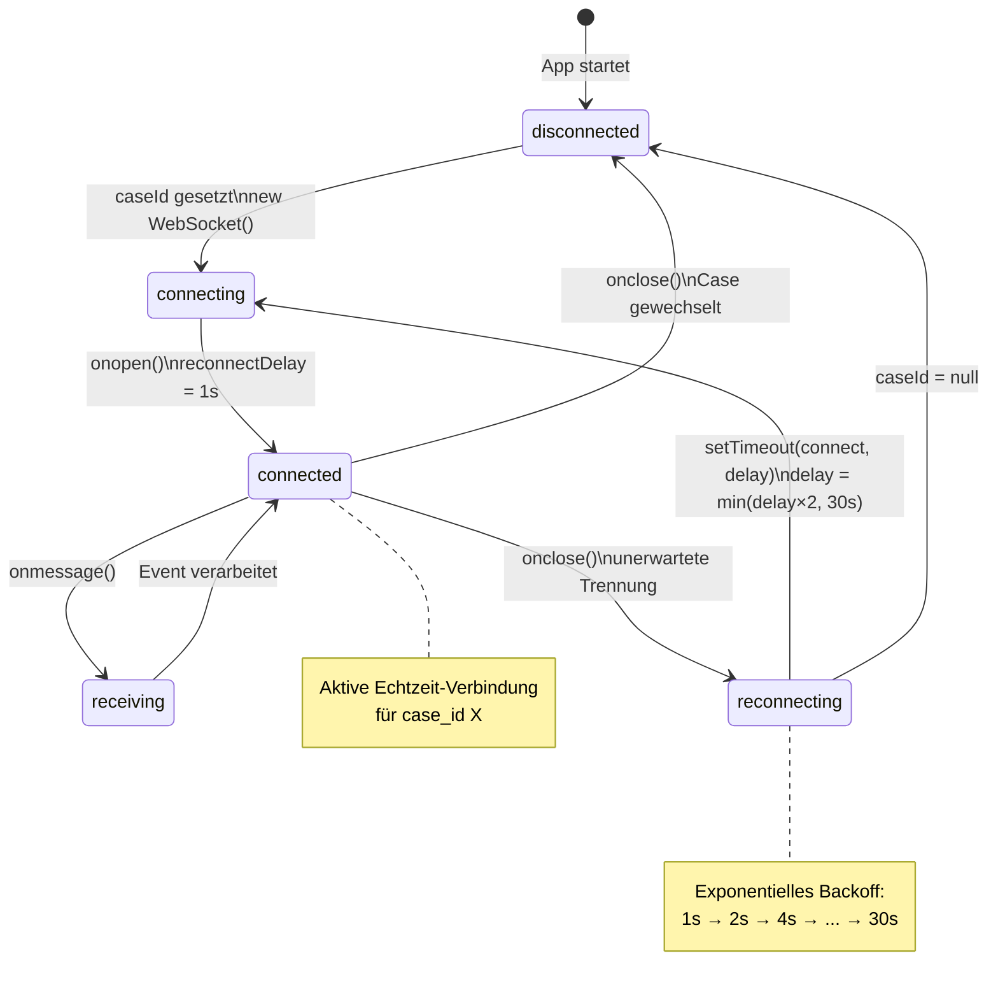

---

## Diagramm-Übersicht

| # | Diagrammtyp | Zeigt |
|---|-------------|-------|
| 1 | Use-Case | Nutzergruppen und ihre Systeminteraktionen |
| 2 | Klassendiagramm | Domain-Modell (Case, Node, Edge, AuditLog, ApiKey) |
| 3 | Klassendiagramm | Transform-Hierarchie (BaseTransform + 10 Implementierungen) |
| 4 | ERD | Datenbankschema mit Beziehungen und Attributen |
| 5 | Komponentendiagramm | System-Architektur und Abhängigkeiten |
| 6 | Sequenzdiagramm | Transform ausführen (vollständiger Flow) |
| 7 | Sequenzdiagramm | Case laden (parallele API-Calls) |
| 8 | Sequenzdiagramm | WebSocket-Verbindung und Event-Handling |
| 9 | Aktivitätsdiagramm | OSINT-Untersuchungsworkflow |
| 10 | Aktivitätsdiagramm | Transform-Execution-Flow inkl. Fehlerbehandlung |
| 11 | Zustandsdiagramm | Transform-Job-Lifecycle |
| 12 | Zustandsdiagramm | WebSocket-Verbindungszustände |
